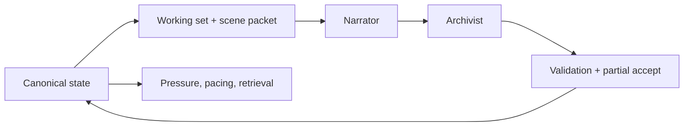

# CLAUDE.md

Primary technical handbook for agents working in Storyforge.

For product vision, current project state, the V1/SF2 distinction, and the knowledge map, read `CONTEXT.md`. For operational behavior, read `AGENTS.md`.

## Project Overview

Storyforge is a solo text RPG where Claude acts as Game Master. Players choose a genre, origin/species, playbook/class, and opening hook; the game then runs a persistent chapter-based campaign with D&D-inspired checks and code-owned state.

SF2 is now the primary `/play` experience. V1 is preserved at `/play/v1` for legacy localStorage saves and maintenance work. `/play/v2` remains as an SF2 alias for older links.

Active genres: `space-opera`, `fantasy`, `grimdark`, `cyberpunk`, `noire`, `epic-scifi`.

## Agent Skills

### Issue Tracker

Issues and PRDs are tracked as local markdown files under `.scratch/`. See `docs/agents/issue-tracker.md`.

### Triage Labels

This repo uses the default five-label triage vocabulary. See `docs/agents/triage-labels.md`.

### Domain Docs

Storyforge is a single-context repo with root `CONTEXT.md` and supporting architecture docs under `docs/`. See `docs/agents/domain.md`.

Current root docs describe SF2. V1 docs are archived under `docs/v1/`.

## Commands

```bash
npm run dev        # Start development server (localhost:3000)
npm run build      # Production build
npm run lint       # ESLint
npm run sf2:replay # Run SF2 replay fixtures
```

Useful focused commands:

```bash
npm run sf2:replay -- fixtures/sf2/replay/<fixture-name>.json
npm run sf2:replay -- fixtures/sf2/replay
npm run sf2:fixture -- --input <export.json> --turn <index> --name <fixture-name>
```

There is no general V1 test suite. SF2 has replay fixtures.

## Architecture

### Routes

| Path | Current role |
|---|---|
| `app/play/page.tsx` | Primary SF2 play page. Wraps `Sf2PlayApp` with access/budget gates. |
| `app/play/v2/page.tsx` | SF2 alias. |
| `app/play/v1/page.tsx` | Legacy V1 client. |
| `app/api/sf2/narrator/route.ts` | Streams prose, roll prompts, final Narrator annotation, diagnostics. |
| `app/api/sf2/archivist/route.ts` | Extracts durable narrative-state patches. |
| `app/api/sf2/arc-author/route.ts` | Creates the long arc plan before Chapter 1. |
| `app/api/sf2/author/route.ts` | Creates chapter setup and pressure surface. |
| `app/api/sf2/chapter-meaning/route.ts` | Synthesizes closed-chapter meaning for the next chapter. |
| `app/api/game/route.ts` | Legacy V1 streaming route. |
| `app/api/auth/route.ts` | Passphrase/session validation. |

### Components

| Area | Files |
|---|---|
| SF2 app orchestration | `components/sf2/play-app.tsx` |
| SF2 play surface | `components/sf2/play-shell.tsx` and sibling panels |
| Setup | `components/setup/*` |
| V1 legacy game loop | `components/game/game-screen.tsx` and related V1 panels |
| Shared UI | `components/ui/*` |

`components/sf2/play-app.tsx` owns IndexedDB boot, campaign activation, setup, Arc Author and Author calls, Narrator stream handling, roll resume, Archivist commit, chapter transitions, saves, and diagnostics exports.

`components/sf2/play-shell.tsx` renders the three-column game surface: character/objective/gear on the left, prose and rolls in the center, locations/present cast/intel on the right.

### SF2 Core Lib

| Area | Files |
|---|---|
| Types and state | `lib/sf2/types.ts`, `lib/sf2/game-data.ts` |
| Client turn flow | `lib/sf2/runtime/client-turn-orchestrator.ts`, `lib/sf2/runtime/turn-pipeline.ts` |
| Narrator | `lib/sf2/narrator/*` |
| Archivist | `lib/sf2/archivist/*` |
| Author roles | `lib/sf2/author/*`, `lib/sf2/arc-author/*`, `lib/sf2/chapter-meaning/*` |
| Retrieval and scene packet | `lib/sf2/retrieval/*` |
| Pressure and pacing | `lib/sf2/pressure/*`, `lib/sf2/pacing/*` |
| Validation and firewall | `lib/sf2/validation/*`, `lib/sf2/firewall/*` |
| Procedures | `lib/sf2/procedure*.ts` |
| Persistence | `lib/sf2/persistence/indexeddb.ts` |
| Shared genre config | `lib/genre-config.ts`, `lib/genres/*` |

### V1 Legacy Lib

V1 remains real code, but it is not the primary `/play` path:

- `app/api/game/route.ts`
- `components/game/*`
- `lib/system-prompt.ts`
- `lib/tools.ts`
- `lib/tool-processor.ts`
- `lib/rules-engine.ts`
- `lib/game-data.ts`
- `lib/types.ts`

Use `docs/v1/*` when changing those surfaces.

## SF2 Key Patterns

### State Over History

`Sf2State` is authoritative. The campaign graph stores arcs, threads, NPCs, factions, decisions, promises, obligations, clues, beats, documents, temporal anchors, procedures, pressure events, and lexicon. Transcript history is a replay/rendering source, not the memory layer.

### Role Pipeline



Role ownership:

- Arc Author: arc plan and initial arc pressure
- Author: chapter setup and pressure surface
- Narrator: prose, roll requests, visible mechanical effects, suggested actions
- Archivist: durable narrative-state extraction
- Chapter Meaning: closed-chapter transition material
- Code: validation, pressure, roll math, retrieval, persistence, diagnostics

### Streaming And Roll Resume

Narrator calls use NDJSON streaming. When `request_roll` appears, the client pauses, resolves the d20, sends `rollResolution`, and the Narrator resumes before ending with `narrate_turn`.

Preserve the streaming feel. Timing, roll pauses, and when text appears are core game feel.

### Validation Before Persistence

Archivist patches are partially accepted. Valid sub-writes land; invalid anchors, illegal transitions, weak evidence, or role leaks are rejected and logged.

The actor firewall throws outside production when a role writes outside its contract.

### Computed Pressure

Thread pressure, local escalation, ladder cooldowns, close readiness, pacing advisories, and working-set retrieval are code-derived. Do not try to fix repeated mechanical drift with prompt wording alone.

### Bounded Context

The Narrator gets a scene bundle, recent in-scene turns, and a per-turn delta. Mutable state must not leak into cached system blocks.

## Game Systems

SF2 currently models:

- chapters with objective, crucible, outcome spectrum, and pressure surface
- arcs and threads with owners/stakeholders
- NPCs and factions with disposition, agenda, heat, identity anchors, voice, and state
- decisions, promises, obligations, clues, documents, temporal anchors, and emotional beats
- roll gates, d20 checks, advantage/disadvantage/challenge, inspiration rerolls
- thread pressure, local escalation, pressure events, and ladder fires
- procedures for operations, access, exploration, investigation, combat, and montage tasks
- scene summaries, recent turns, chapter artifacts, and replay frames
- IndexedDB campaigns and save slots

For details, read `docs/game-systems.md`, `docs/rules-engine.md`, `docs/prompt-composition.md`, and `docs/tool-reference.md`.

## High-Risk Areas

- `app/api/sf2/narrator/route.ts`: streaming protocol, roll pause/resume, repair, sentinels
- `components/sf2/play-app.tsx`: client orchestration and persistence
- `lib/sf2/runtime/turn-pipeline.ts`: commit sequencing
- `lib/sf2/validation/apply-patch.ts`: persistence boundary
- `lib/sf2/pressure/runtime.ts`: chapter pressure and close readiness
- `lib/sf2/retrieval/working-set.ts`: bounded memory selection
- `lib/sf2/narrator/messages.ts`: cache-sensitive message assembly
- `lib/genres/*`: content-heavy genre definitions
- V1 legacy: `app/api/game/route.ts`, `components/game/game-screen.tsx`, `lib/system-prompt.ts`, `lib/tools.ts`, `lib/tool-processor.ts`

## Code Style

- Files: kebab-case (`play-shell.tsx`)
- Components/interfaces: PascalCase (`Sf2PlayShell`, `Sf2State`)
- Variables/functions: camelCase (`buildWorkingSet`)
- Constants: CONSTANT_CASE (`SF2_SCHEMA_VERSION`)
- IDs/keys: snake_case (`thread_missing_witness`)
- Styling: Tailwind CSS utilities; `cn()` from `lib/utils`
- React: functional components with hooks; use `'use client'` for interactive components
- TypeScript: strict mode; explicit exported types; use `export type` for type-only exports
- Anthropic tool definitions: use `type: 'object' as const`

## Tech Stack

Next.js 16, React 19, TypeScript 5.7, Tailwind CSS 4, shadcn/ui/Radix, `@anthropic-ai/sdk`, React Hook Form, Zod, IndexedDB, OKLch color tokens.

## Deploy

```bash
npx vercel --prod --yes
```

Production URL: `storyforge-flame.vercel.app`.
