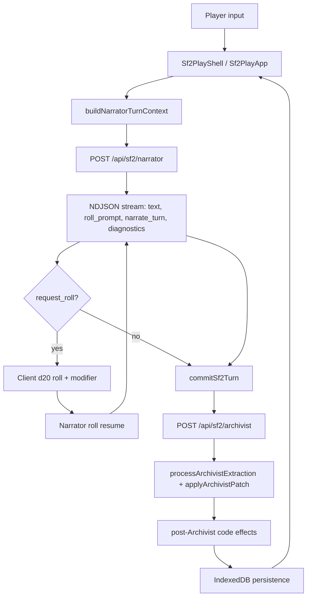
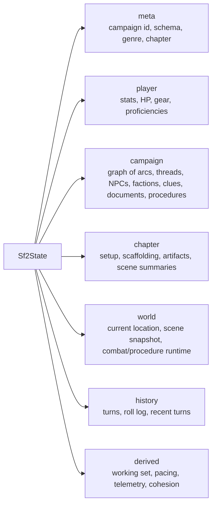
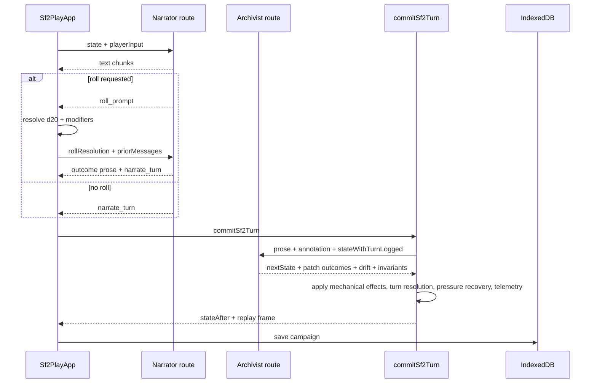

# Storyforge SF2 System Architecture

Storyforge is a solo text RPG where Claude is the GM, but SF2 makes typed game state the authority. `/play` now runs the SF2 engine. V1 remains available at `/play/v1`; `/play/v2` is an alias for the current SF2 play app.

The current architecture is a browser-first Next.js app with no backend database. Campaigns persist in IndexedDB, API routes call Anthropic roles, and deterministic client/server code applies validation, pressure, rolls, retrieval, and diagnostics around model output.

---

## Route Map

| Path | Component / route | Purpose |
|---|---|---|
| `/play` | `app/play/page.tsx` -> `components/sf2/play-app.tsx` | Primary SF2 game |
| `/play/v2` | `app/play/v2/page.tsx` -> `Sf2PlayApp` | SF2 alias |
| `/play/v1` | `app/play/v1/page.tsx` -> `components/game/game-screen.tsx` | Legacy V1 game |
| `/api/sf2/narrator` | `app/api/sf2/narrator/route.ts` | Streams prose, roll prompts, and final turn annotation |
| `/api/sf2/archivist` | `app/api/sf2/archivist/route.ts` | Extracts durable narrative-state patches from prose |
| `/api/sf2/arc-author` | `app/api/sf2/arc-author/route.ts` | Authors the long arc plan before Chapter 1 |
| `/api/sf2/author` | `app/api/sf2/author/route.ts` | Authors chapter setup at chapter boundaries |
| `/api/sf2/chapter-meaning` | `app/api/sf2/chapter-meaning/route.ts` | Synthesizes the closing meaning passed to the next chapter Author |

## Data Flow



The important sequencing detail: the Archivist runs before Narrator mechanical effects are applied. This lets prose-created NPCs exist before `set_scene_snapshot` resolves present cast references.

## Role Ownership

SF2 does not ask one model to do everything.

| Role | Endpoint | Owns | Does not own |
|---|---|---|---|
| Arc Author | `/api/sf2/arc-author` | Arc plan, durable forces, arc threads, latent questions | Turn prose, player mechanics |
| Author | `/api/sf2/author` | Chapter frame, opening scene spec, pressure ladder, starting cast, revelations, pacing contract | Per-turn narration |
| Narrator | `/api/sf2/narrator` | Player-facing prose, roll requests, visible mechanical effects, suggested actions | Durable narrative entities |
| Archivist | `/api/sf2/archivist` | Creates/updates/transitions narrative entities from prose | Player-facing prose, HP/credits/inventory |
| Chapter Meaning | `/api/sf2/chapter-meaning` | Closing interpretation and transition seed | New chapter setup |
| Code | `lib/sf2/*` | Validation, retrieval, pressure, roll math, persistence, diagnostics | Prose style |

Actor ownership is mirrored by the firewall in `lib/sf2/firewall/actor.ts`. In local/dev runs, illegal actor/write pairs throw; in production they remain telemetry signals.

## State Shape

`Sf2State` is the canonical save shape.



Durable memory lives mostly under `campaign`. Chapter-local runtime pressure and scaffolding live under `chapter`. The Narrator receives bounded packets derived from this state, not the entire campaign transcript.

## Main Client

`components/sf2/play-app.tsx` orchestrates:

- IndexedDB boot, campaign activation, save slots, and last-campaign tracking
- setup wizard reuse through `WorldSetup` and `CharacterSetup`
- first-turn Arc Author and Author calls
- Narrator streaming and roll pause/resume
- Archivist extraction and turn commit
- chapter close -> chapter meaning -> next chapter Author
- replay/session JSON exports for diagnostics and fixtures

`components/sf2/play-shell.tsx` renders the primary UI:

- left rail: character, objective/procedure, gear, playbook skill
- center: chapter prose, state diff chips, inline roll cards, action surface
- right rail: locations, present cast, intel/case board
- diagnostics panel: save slots, session/replay export, pressure projection, debug events

## Persistence

SF2 persists through `lib/sf2/persistence/indexeddb.ts`.

| Store | Key | Holds |
|---|---|---|
| `campaigns` | `meta.campaignId` | Full normalized `Sf2State` |
| `campaign_index` | `campaignId` | List metadata for campaign selection |
| `save_slots` | `slot` | Three manual save slots with embedded state |
| `chapter_artifacts` | `[campaignId, chapter]` | Artifact records reserved for chapter data |

`localStorage` only tracks `sf2_last_campaign_id` for resume convenience. V1 still uses V1 localStorage keys through `/play/v1`.

Persisted state is normalized on load by `normalizePersistedSf2State()`: schema version, owner backrefs, legacy arc/thread shapes, location aliases, procedures, pressure events, recent turns, and fallback references are repaired before play resumes.

## Turn Lifecycle



## Replay Harness

SF2 regression coverage lives in `fixtures/sf2/replay/*.json` and runs with:

```bash
npm run sf2:replay -- fixtures/sf2/replay
```

Fixtures are model-free. They capture before/after state, Narrator prose/annotation, Archivist patch, and expected deterministic outcomes. When a playthrough reveals drift, extract the contract into a focused replay fixture rather than depending on another live model call.
