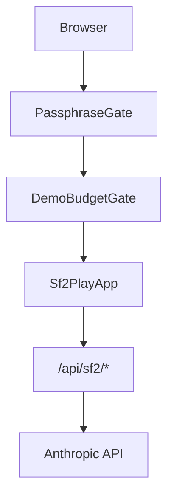

# BYOK And Access Security

How the current `/play` SF2 app handles access gates, demo usage, and bring-your-own Anthropic keys.

Sources: `lib/api-key.ts`, `components/setup/passphrase-gate.tsx`, `components/setup/demo-budget-gate.tsx`, `app/api/auth/route.ts`, `middleware.ts`, `app/api/sf2/*`.

---

## Access Layers

`/play` is wrapped by:

- `PassphraseGate`
- `DemoBudgetGate`
- `Sf2PlayApp`

The same wrapper is used by `/play/v2`. `/play/v1` is legacy V1 and has its own app path.



## BYOK Storage

BYOK means the player provides their own Anthropic API key.

Client-side helpers in `lib/api-key.ts` use:

| Key | Purpose |
|---|---|
| `storyforge_api_key` | Stored Anthropic API key |
| `storyforge_demo_usage` | Local demo-token usage counter |

The API key is stored in browser localStorage. This is convenient for local play, but it is not a secure secret store. The security model is to keep the key on the same origin and avoid third-party exfiltration.

## API Header Flow

`apiHeaders()` adds:

```text
x-anthropic-key: <stored key>
```

when a BYOK key exists. SF2 API routes then choose the BYOK header or the server `ANTHROPIC_API_KEY`.

The browser does not call Anthropic directly. It calls the app origin, and the server route calls Anthropic.

## Demo Usage

Without BYOK, demo mode uses a local token budget:

| Constant | Value |
|---|---|
| `DEMO_MONTHLY_BUDGET` | `250_000` tokens |

The usage record stores the current month and token count. If the month changes, the local counter resets.

This is client-side budget UX, not billing enforcement. Server-side deployment controls still matter for real spend.

## Passphrase Gate

`PassphraseGate` allows access when one of these is true:

- a BYOK key already exists
- the user enters through the BYOK path
- `/api/auth` validates the passphrase and sets the session cookie

`app/api/auth/route.ts` handles the auth check. It uses HMAC-signed cookie behavior for session validation.

## Content Security Policy

`middleware.ts` sets security headers for all non-static routes:

| Header | Purpose |
|---|---|
| `X-Frame-Options: DENY` | Prevent framing |
| `X-Content-Type-Options: nosniff` | Prevent MIME sniffing |
| `Referrer-Policy: strict-origin-when-cross-origin` | Limit cross-origin referrers |
| `Permissions-Policy` | Disable camera, microphone, geolocation |
| `Content-Security-Policy` | Restrict scripts, styles, images, fonts, connections, framing |

The important BYOK line is:

```text
connect-src 'self'
```

That means browser network calls can connect only to the app origin. If a malicious client-side script were injected, the CSP is intended to prevent it from sending the stored key to a third-party host.

## Route Responsibility

Each SF2 API route that calls Anthropic should:

- read the BYOK header if present
- fall back to server `ANTHROPIC_API_KEY`
- avoid logging the raw key
- return diagnostics without secrets
- preserve streaming behavior for Narrator calls

## Operational Notes

- BYOK localStorage is per browser profile.
- Clearing site data removes the stored key and SF2 IndexedDB saves.
- V1 and SF2 share the BYOK helper, but their save stores are separate.
- Diagnostics exports should contain game state and replay data, not API keys.
