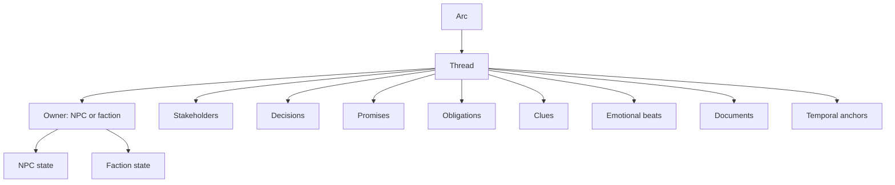
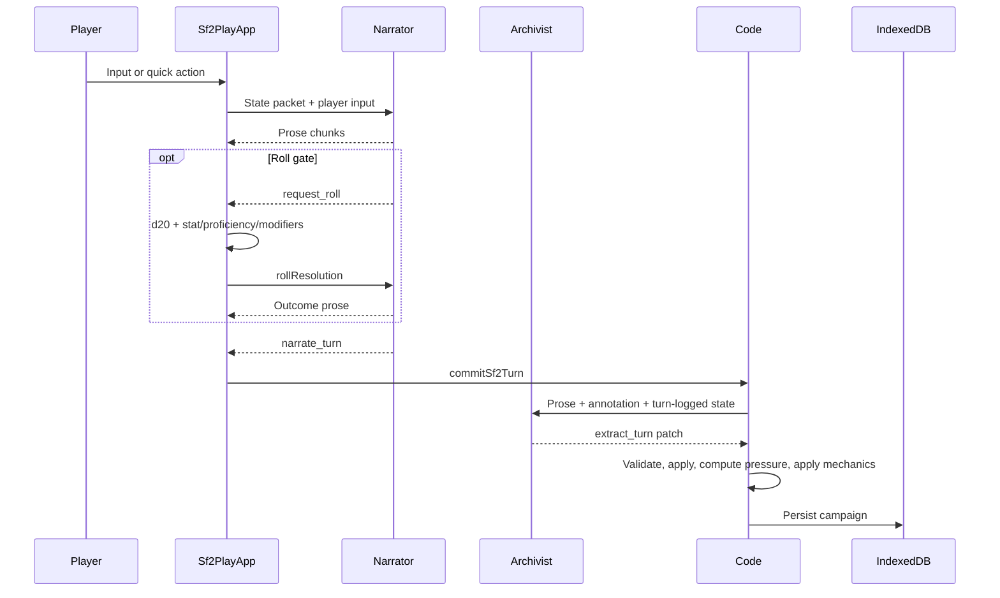
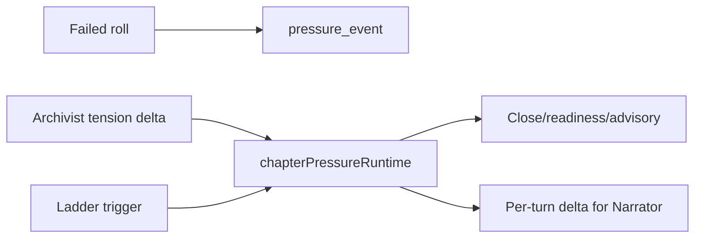

# SF2 Game Systems

How the current `/play` game systems work under the hood.

SF2 is not a prompt-only GM. The model writes against a typed campaign graph, and code owns the parts that need to stay reliable: roll gates, pressure projection, retrieval, validation, persistence, and replay diagnostics.

Sources: `lib/sf2/types.ts`, `components/sf2/play-app.tsx`, `lib/sf2/runtime/*`, `lib/sf2/retrieval/*`, `lib/sf2/pressure/*`, `lib/sf2/procedure*.ts`.

---

## 1. Canonical State

`Sf2State` is the save shape. The current schema version is `3.2.0`.

| Section | Holds |
|---|---|
| `meta` | Campaign id, schema version, genre, selected setup, current chapter |
| `player` | Stats, HP, AC, inventory, playbook, proficiencies, inspiration |
| `campaign` | Arc plan, arcs, threads, NPCs, factions, decisions, promises, obligations, clues, beats, documents, procedures |
| `chapter` | Current chapter setup, pressure scaffolding, scene summaries, artifacts |
| `world` | Current location, scene snapshot, combat/procedure runtime |
| `history` | Turn records, recent turns, roll log |
| `derived` | Working set, pacing signals, cohesion, diagnostics-facing projections |

The campaign graph is the memory layer. Transcript history is a rendering source and replay artifact, not the authority.



Arcs group resolution-dependent threads. Threads are the main units of unresolved tension. NPCs and factions own or participate in threads; retrieval joins thread state back to the owner state before it reaches the Narrator.

## 2. Turn Loop

A player turn runs through Narrator, optional roll pause, commit, Archivist extraction, deterministic effects, and persistence.



The Archivist runs before mechanical post-processing. That sequencing is intentional: if the Narrator introduced a person in prose, the Archivist can create the NPC before the Narrator's scene snapshot or location effects need to resolve that person by id.

## 3. Player Mechanics

The visible player loop is still D&D-inspired:

- d20 checks against a DC
- stat and proficiency modifiers from the player sheet
- advantage, disadvantage, and challenge modifiers
- inspiration rerolls after a failed roll
- fail-forward consequences on misses
- HP, credits, inventory use, scene movement, and combat effects applied by code

The Narrator can request a roll with `request_roll`, but the browser resolves the die and sends the result back. The model does not choose the roll outcome.

Roll gates come from two places:

| Gate source | Example |
|---|---|
| Quick action skill tag | A suggested action ending in `[Insight]` binds the next roll to Insight |
| Heuristic detector | Explicit roll language, attacks, risky movement, social pressure, investigation, technical systems, constrained exits |

If code decides a hard gate is required and the Narrator tries to finish with `narrate_turn` anyway, `/api/sf2/narrator` blocks that turn instead of letting the check disappear.

## 4. Chapter System

SF2 chapters are authored before play by the Author role. A chapter has:

- title, premise, active pressure, central tension
- objective and crucible
- clean, costly, failure, and catastrophic outcome spectrum
- starting cast and visible opening scene
- chapter pressure surface
- pressure ladder steps
- revelations, moral fault lines, and withheld facts
- pacing contract

Chapter close is not a vibe check. `chapterPressureRuntime.project()` and `computeChapterCloseReadiness()` determine whether a chapter should close, reframe, keep pressing, or wait for more resolution. The current close floor is conservative: `MIN_CLOSE_TURN = 18`, unless objective-gate logic says the chapter is ready earlier through the pressure projection.

## 5. Pressure

Current SF2 pressure is thread-driven. Legacy `campaign.engines` still exists in the state shape for compatibility, but the active runtime reads chapter pressure surfaces, thread tension, local escalation, pressure events, ladder cooldowns, and objective progress.

| Pressure input | Effect |
|---|---|
| Thread tension | Durable campaign pressure, used by retrieval and close readiness |
| Local escalation | Chapter-local pressure layered over canonical tension |
| Failed roll events | +2 local pressure on target threads; critical failure is +3 |
| Ladder fire | One-shot chapter escalation with cooldown and per-turn cap |
| Pacing advisories | Signals stagnation, low reactivity, clean-scene drift, or dormant arcs |

The player experiences pressure as people moving, costs increasing, doors narrowing, deadlines biting, and scenes refusing to stay neutral.



## 6. Retrieval And Working Set

The Narrator receives a bounded working set, not the whole campaign graph.

`buildWorkingSet()` scores entities using:

- present NPCs and current interlocutors
- player-named entities in the input
- owner/stakeholder joins from active threads
- spine and load-bearing chapter threads
- current pressure face
- entities mentioned last turn
- recent thread advances
- anchored decisions, promises, obligations, clues, documents, and emotional beats
- floating clues that are still relevant
- explicit GM surface overrides

Caps keep the packet small: 6 full entities, 8 stubs, 5 full threads, and the top 3 emotional beats. The goal is not perfect recall; it is enough authoritative state for the next scene move.

## 7. Scene Packet

`buildScenePacket()` and `renderSceneBundle()` turn state into Narrator input.

| Packet area | Contains |
|---|---|
| Scene | Location, scene snapshot, established facts, atmosphere |
| Cast | Present NPCs, dispositions, agenda, voice, temp load |
| Tensions | Relevant threads and pressure surface |
| Mechanics | Player stats, active procedure/combat, inventory, HP |
| Memory | Recent turns, scene summaries, pivotal context |
| Pacing | Advisories, close readiness, revelation progress |
| Operation plan | Current plan/procedure if active |
| Delta | Mutable per-turn facts: player input, HP, credits, current pressure, action constraints |

The scene bundle is cacheable. The per-turn delta is not. This split is why mutable state is kept out of cached prompt blocks.

## 8. Procedures

Procedures are typed runtime containers for multi-turn activity.

| Dimension | Values |
|---|---|
| Kind | `operation`, `access`, `exploration`, `investigation`, `combat`, `montage_task` |
| Status | `active`, `paused`, `resolved`, `failed`, `abandoned` |
| Phase | `orientation`, `commitment`, `preparation`, `engagement`, `egress`, `reckoning`, `aftermath` |

Procedures can hold facts, constraints, affordances, complications, contributions, assessments, abort conditions, signals, and linked refs. Specialized packet builders derive access, exploration, combat, and investigation surfaces from the generic procedure runtime.

Investigation auto-activates when the state has an active investigation procedure or enough unconsumed clues to make a case surface useful.

## 9. UI Surfaces

`components/sf2/play-shell.tsx` renders SF2 as a three-column play surface.

| Area | Surface |
|---|---|
| Left rail | Character, current objective/procedure, gear, playbook skill |
| Center | Prose stream, state-diff chips, inline rolls, action surface |
| Right rail | Locations, present cast, intel/case board |
| Top/mobile controls | Menu, rails, diagnostics |
| Diagnostics | Save slots, copied session JSON, replay JSON, pressure projection, event log |

`buildTurnStateDiff()` creates player-visible chips for HP, credits, inventory, intel/clues, NPC disposition, locations, operation plan, and thread tension. The diagnostics export is the bridge from live play to replay fixtures.

## 10. Persistence

SF2 uses IndexedDB through `lib/sf2/persistence/indexeddb.ts`.

| Store | Purpose |
|---|---|
| `campaigns` | Full `Sf2State` by campaign id |
| `campaign_index` | Campaign list metadata |
| `save_slots` | Manual save slots with embedded state |
| `chapter_artifacts` | Reserved chapter artifact storage |

`normalizePersistedSf2State()` repairs old or partial state on load: schema version, owner backrefs, arc/thread shapes, procedures, locations, pressure events, recent turns, and fallback references.

V1 localStorage saves remain separate and are only used by `/play/v1`.

## 11. Replay Diagnostics

SF2 replay fixtures live under `fixtures/sf2/replay/*.json`.

Use them when changing SF2 contracts:

```bash
npm run sf2:replay -- fixtures/sf2/replay
```

Fixtures are model-free. They capture state, prose, annotations, patches, expected accepted writes, rejected writes, pressure effects, sentinels, and deterministic outcomes. If a live playthrough exposes a bug, copy session/replay JSON from diagnostics, save it under a run-specific `.scratch/` artifact folder, then trim it into a focused fixture.
