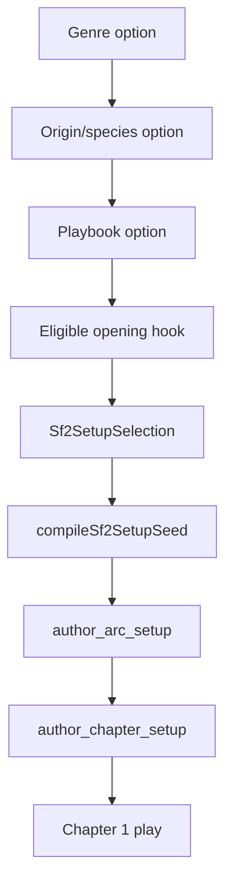

# SF2 Genre Config System

Developer reference for how Storyforge's shared genre layer feeds the current SF2 `/play` engine.

The genre configs remain shared infrastructure. V1 and SF2 both read from `lib/genre-config.ts` / `lib/genres/*`, but SF2 uses the config through setup selection, Author seed compilation, scene-packet styling, and role prompt grounding.

Sources: `lib/genres/index.ts`, `lib/genre-config.ts`, `lib/sf2/setup/options.ts`, `lib/sf2/setup/compile-seed.ts`, `lib/sf2/genre-profile.ts`, `components/setup/*`, `components/sf2/*`.

---

## Active Genres

Playable genres:

- `space-opera`
- `fantasy`
- `grimdark`
- `cyberpunk`
- `noire`
- `epic-scifi`

Stubbed but unavailable genres:

- `western`
- `zombie`
- `wasteland`
- `cold-war`

The setup wizard filters by `genres.filter((genre) => genre.available)`.

## Shared Config Shape

`GenreConfig` provides:

| Area | Examples |
|---|---|
| Identity | `id`, `name`, `tagline`, `available` |
| Character options | `species`, `speciesLabel`, `classes`, optional origin-keyed `playbooks` |
| Mechanics | stats, proficiencies, traits, starting inventory, starting HP/AC/credits |
| UI vocabulary | currency, companion label, intel label, exploration label, heat label |
| Theme | fonts, colors, severe token, background effect |
| Prompt language | role, setting, vocabulary, tone override, trait rules, asset mechanic, investigation guide |
| Lore | deep lore, lore facets, lore anchors, atmospheric palettes |
| Campaign starts | opening hooks, starting contacts, starting crew templates |

The config should carry genre-specific language. The engine should avoid `if genre === ...` branches unless the behavior is truly mechanical and cannot be represented as data.

## SF2 Setup Flow

Setup helpers:

| Helper | Purpose |
|---|---|
| `listSf2SetupGenres()` | Playable genre picker |
| `listSf2SetupOrigins()` | Origin/species picker, excluding hidden shifted origins |
| `listSf2SetupPlaybooks()` | Origin-keyed playbooks if present, otherwise genre classes |
| `listSf2SetupHooks()` | Hook options eligible for the selected origin/playbook |
| `compileSf2SetupSeed()` | Converts config and selection into an Author seed |

Hook ids are stable slugs plus a short content hash. This lets the wizard remember a chosen hook without relying on array indexes.

## Opening Hook Eligibility

Opening hooks may include:

- `title`
- `hook`
- `origins`
- `classes`
- `startingCounters`
- `startingCrew`
- `frame`
- `arc`

Eligibility is strict. A hook is available when it is universal or its origin/playbook filters match the current selection. Class-specific hooks are expected to be paired with origin filters in the current data model.

In SF2, hook `frame` and `arc` fields are not just flavor. They become part of the Author seed, shaping the first chapter's objective, crucible, and arc pressure.

## Author Seed Compilation

`compileSf2SetupSeed()` adapts shared genre config into SF2-specific Author input.

It derives:

- setting summary
- opening pressure
- institutional forces
- social pressures
- likely affiliations
- faction voice rules
- banned registers
- vocabulary handles
- tone principles
- playbook fit from `playbookProfile`
- origin lore and behavioral directives
- starting inventory and trait information

This is where generic genre data becomes chapter-authorable pressure.

## Prompt Sections

SF2 still uses the shared prompt sections, but not through the old V1 prompt stack.

| Config field | SF2 use |
|---|---|
| `promptSections.role` | Stable role/genre identity in system blocks |
| `promptSections.setting` | Genre bible and setting grounding |
| `promptSections.vocabulary` | Lexicon, proper nouns, genre-specific nouns |
| `promptSections.toneOverride` | Narrator voice constraints |
| `promptSections.narrativeCraft` | Prose craft and pacing guidance |
| `promptSections.traitRules` | Class trait expectations for mechanics |
| `promptSections.assetMechanic` | Ship/company/office/base pressure where relevant |
| `promptSections.investigationGuide` | Case/clue handling for investigation scenes |
| `promptSections.npcVoiceGuide` | Cast voice differentiation |

Genre prompt content should remain strongly flavored. SF2's bounded packets make it easier to keep genre loud without letting lore sprawl replace state.

## Theme And UI Labels

`applyGenreTheme()` writes CSS custom properties and `data-genre` on the root element. SF2 UI surfaces use the same theme variables as V1, with newer fields such as `statLabels`, `severe`, and atmospheric palettes used where available.

Important UI vocabulary:

- `currencyName` and `currencyAbbrev`
- `companionLabel`
- `notebookLabel`
- `intelTabLabel`
- `intelNotebookLabel`
- `intelOperationLabel`
- `explorationLabel`
- `heatLabel`
- `statLabels`

When adding a new SF2 UI panel, read labels from the config instead of hard-coding generic RPG terms.

## Starting Contacts And Crew

Origins can define `startingContacts`. Genres can define `startingCrew`. SF2 setup and Author calls use these as pressure-bearing relationships rather than disconnected flavor.

Starting crew templates intentionally omit final identity details. The Author and Narrator establish names, voice, key facts, and relationship hooks through setup and play, then the Archivist persists the durable facts.

## Atmospheric Palettes

`atmosphericPalettes` let SF2 choose atmosphere by location archetype and pressure surface:

- `baseline`
- `authority`
- `debt`
- `transit`
- `institutional`
- `danger`

These palettes help the scene packet make an authority office feel different from a transit corridor without inventing a separate prompt branch for every genre.

## Adding Or Changing A Genre

Checklist:

1. Add or update the genre config in `lib/genres/*`.
2. Keep `available` accurate in `lib/genres/index.ts`.
3. Provide origins/species, playbooks/classes, theme, labels, prompt sections, and opening hooks.
4. Add `playbookProfile` where Author pressure should adapt to natural player moves.
5. Verify hook eligibility with the selected origin and playbook.
6. Check SF2 setup seed output if the genre needs special institutional pressure.
7. Run the app setup flow or add focused fixtures if behavior changes.

Avoid normalizing genre voices. Storyforge wants a grimdark company, a noir case, and an epic-scifi Hegemony to feel mechanically and linguistically distinct.
