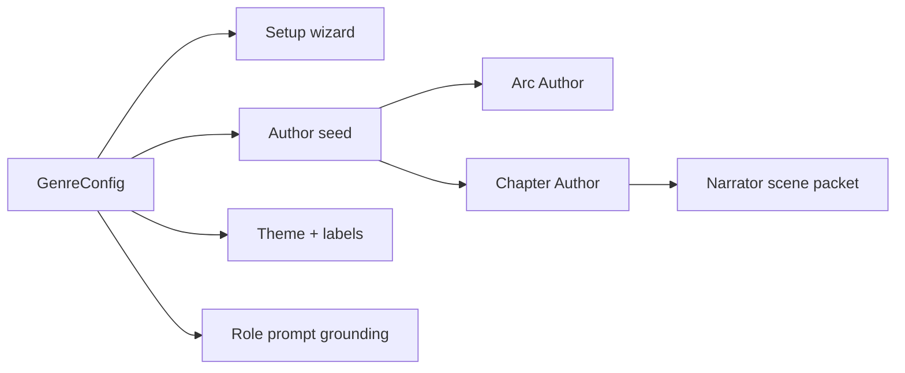

# SF2 Genres

Current genre catalogue for the SF2 `/play` engine.

Storyforge genres are not skins. Each genre brings character options, tone, institutions, pressure surfaces, UI vocabulary, theme tokens, and opening hooks that shape the Author seed.

Sources: `lib/genres/*`, `lib/genres/index.ts`, `lib/sf2/setup/compile-seed.ts`.

---

## Playable Genres

| Slug | Name | Core pressure |
|---|---|---|
| `space-opera` | Space Opera | Frontier scarcity, ship logistics, faction access, crew trust |
| `fantasy` | Fantasy | Dangerous knowledge, old institutions, ruin pressure, grounded magic |
| `grimdark` | Grimdark | Survival costs, rationed mercy, Church/company pressure, moral injury |
| `cyberpunk` | Cyberpunk | Corporate infrastructure, surveillance, body compromise, street trust |
| `noire` | Noir | Hidden truth, favors, records, syndicates, respectability as violence |
| `epic-scifi` | Epic Sci-Fi | Hegemony, Synod doctrine, Resonant control, feudal-imperial obligation |

Unavailable stubs remain in the registry for future expansion: Western, Zombie Apocalypse, Post-Atomic Wasteland, and Cold War.

## Space Opera

Space Opera is practical frontier science fiction: ships, corridors, fuel, back channels, salvage, debt, and warm crew pressure under scarcity.

Common forces:

- Compact Remnants
- Corporate Blocs
- Pirate Fleets
- frontier settlements
- rogue AI infrastructure
- station and route authorities

System surfaces:

- ship/base asset pressure
- crew cohesion and trust
- route access and permits
- fuel, parts, cargo, reputation, and debt as pressure
- practical NPC speech with warmth under pressure

Avoid fantasy nouns, Hegemony-specific Epic Sci-Fi language, and clean lore dumps about the Compact before the scene makes them matter.

## Fantasy

Fantasy is not generic high fantasy. It is old-knowledge pressure: the past remains active through records, ruins, wards, lineages, and institutions that claim custody over dangerous truth.

Common forces:

- The Collegium
- Five Kingdoms
- churches and lordships
- ruin expeditions
- merchant patrons
- families tied to inheritance or knowledge

System surfaces:

- ruin and archive pressure
- dangerous inscriptions, relics, wards, and codices
- common folk needing practical answers before theory
- magic as echo and cost rather than abundance

Avoid clean prophecy language that removes mud, politics, fatigue, institutional cost, or local need.

## Grimdark

Grimdark is survival under institutions that sell necessity as virtue. Mercy costs resources. Hope can be used against people.

Common forces:

- Church provision offices
- mercenary companies
- village councils
- warlord retinues
- black-market quartermasters
- refugee bands

System surfaces:

- provisions, morale, shelter, medicine, and maps as pressure
- promises that matter because institutions do not
- scarce recovery scenes
- visible human costs on every "necessary" choice

Tone should be hard-edged without becoming weightless cruelty. The genre works when a small mercy is expensive enough to mean something.

## Cyberpunk

Cyberpunk is compromise inside owned systems. Infrastructure records someone, erases someone else, and prices survival through corporate, street, and body-level debt.

Common forces:

- megacorp divisions
- street crews
- private security
- data brokers
- fixers
- black clinics
- city authorities

System surfaces:

- identity and surveillance pressure
- augments, ICE, drones, clinics, arcologies
- corp liability language
- favors, access, anonymity, and compromised trust

Avoid chosen-one framing, fantasy/feudal language, and exposition before a person or system makes the information actionable.

## Noir

Noir is the cost of truth in a city built to protect versions of it. Favors, files, photographs, ledgers, alibis, unions, syndicates, and old money decide who can be hurt safely.

Common forces:

- police departments
- city hall
- newspapers
- unions
- syndicates
- private clients
- old-money families

System surfaces:

- case files and evidence
- favors owed
- witness pressure
- alibis, records, ledgers, photographs
- truth that becomes dangerous when public

Avoid parody detective voice and clean procedural certainty. The case should feel solvable, but not clean.

## Epic Sci-Fi

Epic Sci-Fi is the Hegemony genre: feudal-imperial pressure, Synod doctrine, Resonant control, Great House obligation, and the Undrift surviving through suppressed truth.

Common forces:

- The Synod
- Great Houses
- Imperial Service
- The Undrift
- frontier settlements
- sworn retainers and personnel

System surfaces:

- institutional language: mandate, tithe, allocation, writs, Conclave
- compliance framed as care
- power that sounds courteous while narrowing choices
- Drift infrastructure with human cost
- profile facts, identity anchors, and official truth under pressure

Avoid casual space-opera slang, cyberpunk corp vocabulary, and clean exposition about the Hegemony before a person or institution makes it matter.

## Genre In SF2 Setup

The same genre config feeds selection UI, chapter setup, role prompts, and theme. If genre language changes, inspect both setup seed output and Narrator packets.

## Design Rule

Do not sand the genres into one neutral RPG voice. Shared mechanics are good; shared prose register is not. The genre should change what institutions matter, what nouns the UI uses, what a roll costs, and what kind of consequence feels inevitable.
