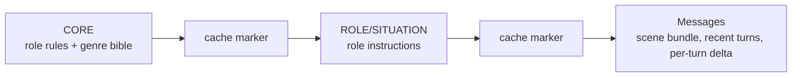

# SF2 Prompt Composition

Technical reference for how the current SF2 `/play` engine assembles prompts and messages for Claude roles.

SF2 prompt composition has two goals:

1. Keep stable identity, genre, and role rules cacheable.
2. Keep mutable game state out of cached prefixes.

Sources: `lib/sf2/prompt/cache.ts`, `lib/sf2/narrator/messages.ts`, `lib/sf2/narrator/turn-context.ts`, `lib/sf2/retrieval/scene-packet.ts`, `lib/sf2/author/*`, `lib/sf2/archivist/*`.

---

## Role Calls

| Role | Endpoint | Primary input | Tool |
|---|---|---|---|
| Arc Author | `/api/sf2/arc-author` | Setup seed from genre/origin/playbook/hook | `author_arc_setup` |
| Chapter Author | `/api/sf2/author` | Arc state, previous chapter meaning, carry-forward threads | `author_chapter_setup` |
| Narrator | `/api/sf2/narrator` | Scene bundle, recent turns, per-turn delta, player input | `request_roll`, `narrate_turn` |
| Archivist | `/api/sf2/archivist` | Narrator prose, annotation, state with turn logged | `extract_turn` |
| Chapter Meaning | `/api/sf2/chapter-meaning` | Completed chapter turns and state | `synthesize_chapter_meaning` |

Each role has a narrow output contract. Prompting reinforces the boundary, but `lib/sf2/firewall/actor.ts` is the real guardrail.

## Cache Shape

`composeSystemBlocks()` builds stable blocks with cache markers. The intended order is:

Dynamic facts must stay in messages. `assertNoDynamicLeak()` checks that current HP, turn number, player input, credits, and similar mutable fields do not leak into cached system blocks.

## Narrator Message Stack

`buildNarratorMessages()` assembles the Narrator call from three layers:

| Layer | Stability | Purpose |
|---|---|---|
| Scene bundle | Mostly stable within a scene | Location, cast, tensions, memory, mechanics, chapter frame |
| In-scene turns | Growing stable prefix | Prior player/Narrator exchanges in the current scene |
| Per-turn delta | Mutable | Current player input, roll state, pressure changes, HP/credits/current mechanics |

If there is no prior assistant message, the scene bundle can receive the message-level cache marker. Otherwise the marker sits on the last prior assistant message so the prefix grows incrementally.

## Scene Bundle

The scene bundle is rendered from `buildScenePacket()` and `renderSceneBundle()`. It is the Narrator's bounded context.

It includes:

- current scene and location
- present cast and current interlocutors
- relevant threads and pressure face
- emotional beats
- revelation and passive-awareness progress
- temporal anchors
- chapter frame and scaffolding
- active mechanics/procedures
- operation plan
- recent scene context
- pacing advisories

It does not include the whole campaign graph.

## Per-Turn Delta

`renderPerTurnDelta()` carries facts that can change every request:

- player input
- mutable player state
- current HP, credits, inspiration, inventory changes
- current cast read
- thread tension and pressure projection
- active procedure/combat readout
- roll resolution when resuming after a `request_roll`
- one-turn instructions, gates, and diagnostics

The delta is intentionally uncached.

## Narrator Stream Contract

`/api/sf2/narrator` streams NDJSON events. Important event types include:

| Event | Meaning |
|---|---|
| `working_set` | Entity/thread set selected for the turn |
| `scene_bundle_built` | Scene bundle diagnostics |
| `pacing_advisory` | Computed pacing pressure |
| `roll_gate_diagnostic` | Gate detection output |
| `text` | Player-facing prose chunk |
| `roll_prompt` | Browser should pause and roll |
| `narrate_turn` | Final Narrator annotation and mechanical effects |
| `display_sentinel` | Output contract findings |
| `narrator_output_recovered` | Repair succeeded |
| `token_usage`, `latency`, `truncation_warning` | Diagnostics |
| `error`, `done` | Terminal events |

The route sets `disable_parallel_tool_use: true` for Narrator calls. This prevents partial multi-tool dispatch from dropping the exact roll or final commit the client is waiting for.

## Roll Resume Prompting

When the Narrator calls `request_roll`, the stream pauses. The browser resolves the die, then sends a follow-up request with:

- prior messages
- the roll request
- the player-visible roll result
- the current state packet
- `rollResolution`

The Narrator then writes the outcome and ends with `narrate_turn`. The model never selects the die value.

## Archivist Prompting

The Archivist receives the completed prose and Narrator annotation. Prose is ground truth; the annotation is only a hint.

The prompt asks for flat semantic writes:

- creates
- updates
- transitions
- attachments
- scene result
- pacing classification
- pressure events
- coherence findings

Code then resolves ids, validates anchors, dedupes, rejects invalid sub-writes, and records drift.

## Author Prompting

The active Chapter Author path is a single `author_chapter_setup` tool call. The older `author_chapter_spine` and `author_pressure_surface` schema pieces remain in code as local building blocks, but they are not exported in the active `AUTHOR_TOOLS` array.

Author output becomes chapter setup and scaffolding:

- frame and objective
- opening scene spec
- antagonist field
- starting NPCs
- active threads
- pressure ladder
- revelations
- moral fault lines
- pacing contract

Arc Author runs before Chapter 1 when the campaign does not yet have an arc plan.

## Repair Prompts

The Narrator route can run a corrective retry for narrow failures:

- missing `narrate_turn`
- missing or malformed `suggested_actions`
- required roll gate skipped
- display-sentinel violations that are currently repairable

Repair prompts should stay narrow. If a model repeatedly fails a mechanical task, move the responsibility to code or validation instead of adding more prose instructions.

## Model Defaults

The Narrator model comes from `SF2_NARRATOR_MODEL` and currently defaults to `claude-sonnet-4-6`. Other role routes have their own model selection in their route files. Treat model names and prompt-cache behavior as live integration details; verify the route before changing docs or behavior.
