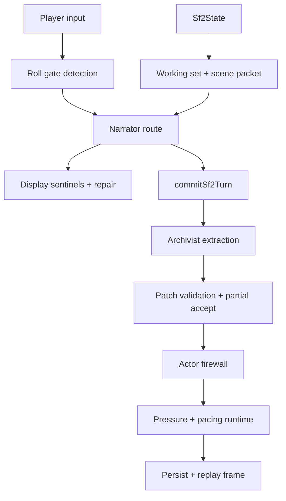

# SF2 Rules Engine

SF2 does not have one monolithic `rules-engine.ts`. Rules live in small runtime modules under `lib/sf2/`, then meet during Narrator context building and `commitSf2Turn()`.

The rule of thumb: models propose fiction; code decides whether the mechanical contract was met, applies deterministic consequences, and records drift.

Sources: `lib/sf2/narrator/roll-gates.ts`, `lib/sf2/action-resolver/resolve.ts`, `lib/sf2/pressure/runtime.ts`, `lib/sf2/pacing/signals.ts`, `lib/sf2/validation/apply-patch.ts`, `lib/sf2/firewall/actor.ts`, `lib/sf2/sentinel/display.ts`, `scripts/sf2-replay.cjs`.

---

## Overview



The rules engine is distributed because each rule belongs near the state it protects:

| Rule family | Primary files |
|---|---|
| Roll gates | `lib/sf2/narrator/roll-gates.ts` |
| Roll modifiers and outcomes | `lib/sf2/action-resolver/resolve.ts`, `lib/sf2/social-modifiers/evaluate.ts` |
| Pressure and close readiness | `lib/sf2/pressure/runtime.ts`, `lib/sf2/pressure/derive.ts` |
| Pacing advisories | `lib/sf2/pacing/signals.ts` |
| Patch validation | `lib/sf2/validation/apply-patch.ts` |
| Role ownership | `lib/sf2/firewall/actor.ts` |
| Player-visible output sentinels | `lib/sf2/sentinel/display.ts` |
| Regression contracts | `fixtures/sf2/replay/*.json` |

## Roll Gate Enforcement

Roll gates protect uncertainty. A roll is required when the player action has meaningful risk and the outcome should not be chosen by the GM.

Detected hard gates include:

- explicit roll/check language
- attack or combat action
- save-like resistance against immediate harm or compulsion

Expected roll advisories include:

- investigation/search/examination
- NPC information extraction
- social pressure or coercion
- technical/system intrusion
- risky movement or physical contest
- constrained departure from a dangerous scene
- player-authored bracketed skill hints, such as `[Insight]`

The Narrator emits clean quick-action labels; code strips model-authored bracket tags instead of creating hidden skill bindings. Expected advisories strongly prefer `request_roll`, but the route can allow `narrate_turn` if the Narrator resolves decisively, lands a visible delta, and logs a diagnostic. If a hard gate is required and the Narrator emits `narrate_turn` without first calling `request_roll`, the Narrator route blocks the turn with a diagnostic instead of letting the model skip the mechanic.

## Roll Resolution

The Narrator can request:

- `skill`
- `dc`
- `why`
- `consequence_on_fail`
- optional `modifier_type`: `advantage`, `disadvantage`, or `challenge`
- optional `modifier_reason`

The browser resolves the die. Code applies stat/proficiency modifiers, advantage/disadvantage, challenge, and inspiration rerolls. The result is sent back to the Narrator as `rollResolution`, and the Narrator continues from the paused moment.

The `rollResolution` message keeps the UI-facing result enum small (`critical`, `success`, `failure`, `fumble`) but adds narration guidance from the margin:

| Posture | Core rule | Narration contract |
|---|---|---|
| Strong success | yes, and | Intent succeeds plus leverage, extra intel, pressure relief, better position, or saved resources. |
| Clean success | yes | Intent succeeds as stated. |
| Narrow success | yes, but | Intent succeeds; cost lands around the success. Do not downgrade to partial recovery. |
| Partial success | partly yes, partly no | Use for divisible goals, not as the default close-success outcome. |
| Narrow failure | no, but | Clean result fails, but the attempt reveals a new playable route or opening. |
| Failure | no, and | Goal fails and pressure, risk, loss, or enemy position worsens. |
| Hard failure | no, and now the board changes | Major setback, still playable: wound, capture, split party, forced retreat, shifted custody, or aftermath consequence. |

Failed rolls can also create pressure. Current deterministic pressure recovery applies local escalation to target threads: ordinary failure is +2, critical failure is +3.

## Social Modifiers

`lib/sf2/social-modifiers/evaluate.ts` can override or supplement the requested modifier when state clearly supports it. Inputs include origin, disposition, faction pressure, cohesion-like relationship state, and current social context.

This keeps social math state-derived. The Narrator can explain why a check is hard or favorable, but code owns the final modifier contract.

## Pressure Runtime

Current pressure is thread-driven.

| Concept | Meaning |
|---|---|
| Canonical tension | Durable tension on `campaign.threads` |
| Local escalation | Chapter-local pressure layered on top of the thread |
| Opening floor | Author-specified minimum pressure for a chapter thread |
| Ladder fire | One-shot escalation step tied to chapter pressure |
| Pressure event | Human-consequence record of who pays and what got harder |

`campaign.engines` remains in the state shape for legacy compatibility, but current chapter pressure reads thread pressure surfaces and chapter scaffolding.

Ladder rules:

- no repeated fire on consecutive turns for the same step
- maximum two ladder fires per turn
- fired steps are tracked so they do not repeat as if new
- ladder output is recorded as code-owned pressure, not Narrator invention

## Chapter Close Readiness

`computeChapterCloseReadiness()` is the current close gate. It uses projected chapter pressure, objective gate state, spine thread state, pivot signals, stagnation, and turn count.

Important current behavior:

- the minimum close floor is `MIN_CLOSE_TURN = 18`
- objective gate can recommend close or reframe when the current chapter question has resolved
- pivot signaling and spine resolution matter
- stalled chapters can fall back into close/reframe pressure instead of drifting forever

This differs from older V1 docs that described 10-18 turn chapters and a turn-20 hard close. SF2 is more explicit about objective and pressure readiness.

## Pacing Advisories

`lib/sf2/pacing/signals.ts` computes advisories that are passed to the Narrator and surfaced in diagnostics.

| Advisory | Trigger shape |
|---|---|
| Low reactivity | World-initiated pressure ratio under threshold across recent turns |
| Scene link discipline | Multiple clean scene closures without enough forward hook |
| Thread stagnation | Repeated touches with little or no total tension movement |
| Arc dormancy | Arc threads receive no progress for several current-chapter turns |

These are advisories, not automatic prose. They give the Narrator a state-derived reason to push, link, or reframe.

Pacing advisories can also recommend a narrative tempo mode and required delta. The current modes are `micro_scene`, `compression_turn`, `time_jump`, `montage`, `aftermath`, `downtime`, and `chapter_turn`. Non-micro modes tell the Narrator to compress routine steps and move state, not replay the same small obstacle.

## Patch Validation

The Archivist emits semantic patch proposals through `extract_turn`. Code applies valid sub-writes and rejects invalid sub-writes. This partial-accept model is important: one bad anchor should not throw away all valid state extraction from a turn.

Validation responsibilities include:

- canonical id lookup and dedupe
- owner and stakeholder normalization
- anchor requirements for decisions and promises
- floating clue allowance only for real evidence that is not anchored yet
- document lifecycle constraints
- procedure shape normalization
- status transition legality
- confidence handling

Low-confidence writes are logged but generally not persisted as durable facts.

## Actor Firewall

`lib/sf2/firewall/actor.ts` enforces which actor can write which kind of state.

| Actor | Allowed writes |
|---|---|
| Narrator | HP, credits, inventory use, location, scene end, scene snapshot, pending check, suggested actions, annotation |
| Archivist | Entity creation/update/transition, anchor attachment, pacing classification, drift flag |
| Author | Chapter setup, chapter meaning |
| Code | Face shifts, ladder fires, passive awareness delivery, working set compute, cohesion recompute, drift flag |

In local and test runs, illegal actor/write pairs throw immediately. In production, the same decision is returned as telemetry so the app can keep running.

## Display Sentinels And Repair

The Narrator route scans output for player-visible contract violations.

Current repaired cases include:

- leaked raw roll values or DC math in prose
- suggested action leakage into prose instead of the tool payload
- malformed or missing `suggested_actions`
- missing final `narrate_turn` tool call

Other sentinel findings can remain observe-mode diagnostics depending on the rule. The important distinction is that the sentinel layer is already wired, but not every finding is enforced as a repair.

## Replay Fixtures

Replay is the SF2 regression harness:

```bash
npm run sf2:replay -- fixtures/sf2/replay
```

Use a focused fixture when changing:

- roll gate behavior
- narrator stream recovery
- patch validation
- pressure projection
- working set scoring
- display sentinel behavior
- turn commit effects
- procedure mechanics
- chapter close readiness

Fixtures should be deterministic and model-free. If the bug is inside an API route, extract the contract into a helper and fixture that helper rather than relying on another live Anthropic call.
