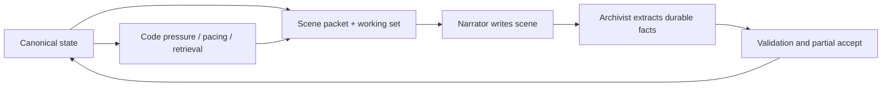
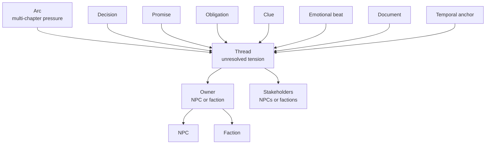

# Storyforge 2 Design

SF2 is the current `/play` engine. It is a context-engineering rebuild whose central product bet is simple: managing game state is the game.

The model writes prose against typed, validated ground truth. It does not carry campaign memory in transcript history, invent mechanics by vibe, or decide alone when pressure has meaningfully changed.

---

## Thesis

SF2 replaces "big prompt plus long chat history" with a bounded role pipeline:

The loop is not model memory. It is state -> bounded context -> prose -> patch -> validation -> state.

## Durable Principles

- **State over history.** `Sf2State` is authoritative. Transcript history is a recent-scene rendering source and a replay artifact, not the campaign's memory.
- **Bounded scene context.** The Narrator receives a scene bundle, in-scene turns, and a per-turn delta. It does not receive the whole campaign graph.
- **Flat writes, structured storage.** The Archivist emits semantic patch proposals. Code resolves IDs, anchors, owner backrefs, deduplication, validation, and persistence.
- **Roles with hard ownership.** Author shapes chapters, Narrator writes the visible turn, Archivist extracts durable narrative state, Code owns enforcement.
- **Validation before persistence.** Valid sub-writes land, invalid sub-writes are rejected or deferred, and drift is logged explicitly.
- **Computed pressure.** Chapter pressure, close readiness, roll gates, pacing advisories, and retrieval are code-derived.

## Role Model

| Role | Timing | Output | Persistence boundary |
|---|---|---|---|
| Arc Author | Before Chapter 1 when no active arc plan exists | `author_arc_setup` | Transformed into `campaign.arcPlan`, arc entity, arc threads, durable factions |
| Chapter Author | Chapter open | `author_chapter_setup` | Transformed into `chapter.setup`, `chapter.scaffolding`, opening artifacts, starting entities |
| Narrator | Every player turn | prose, `request_roll`, `narrate_turn` | Prose and compact annotation are logged; mechanical effects are applied by code |
| Archivist | After each Narrator commit | `extract_turn` | Patch is normalized, validated, partially accepted, and attached to turn history |
| Chapter Meaning | Chapter close | `synthesize_chapter_meaning` | Meaning is stored in chapter artifacts and passed to next Author call |

## Current Shipped Shape

The implementation is no longer an isolated `/play/v2` experiment:

- `/play` is SF2 primary.
- `/play/v2` is an alias.
- `/play/v1` remains for V1 saves and V1 behavior.
- SF2 state persists in IndexedDB under `storyforge_sf2`.
- SF2 routes live under `app/api/sf2/*`.
- SF2 runtime code lives under `lib/sf2/*`.
- Shared genre content still lives under `lib/genre-config.ts` and `lib/genres/*`.

## Entity Graph

Arcs group resolution-dependent threads. Threads are the main units of unresolved tension. NPCs and factions own threads; their disposition, agenda, heat, identity anchors, and owner backrefs are queried with the threads they own.

Decisions and promises require anchors. Clues may start floating and later attach. Documents have typed lifecycle semantics. Emotional beats are moment-grain memory with a one-per-turn cap.

## Chapter Shape

A chapter is not an arbitrary conversation window. It has:

- a frame: premise, objective, central tension, crucible, outcome spectrum
- a pressure surface: spine thread, load-bearing threads, thread pressure, human stakes
- a pressure ladder: code-tracked steps that fire only once and observe cooldown/cap rules
- starting cast and off-stage chapter cast
- possible revelations, hint gates, moral fault lines, escalation options
- pacing contract with target turn range and chapter question
- opening artifact for the establishment turn

Close readiness comes from `chapterPressureRuntime.project()` and `computeChapterCloseReadiness()`, not from the Narrator deciding a chapter "feels done."

## Memory Taxonomy

| Memory | Stored as | Used by |
|---|---|---|
| Recent scene turns | `history.turns`, `history.recentTurns` | Narrator replay window |
| Scene summary | `chapter.sceneSummaries` | Scene bundle and chapter continuity |
| Durable tension | `campaign.threads` | Retrieval, pressure, close readiness |
| Entity identity | `campaign.npcs`, `campaign.factions`, `campaign.locations`, `campaign.documents` | Working set and sentinels |
| Emotional moment | `campaign.beats` | Emotional beat packet |
| Genre language | `campaign.lexicon` plus genre bible | Scene bundle and prose style |
| Diagnostics | `diagnosticsStore`, replay frames, invariant events | Debug panel and fixtures |

## What Is Legacy

- `app/api/game/route.ts`, `lib/system-prompt.ts`, `lib/tools.ts`, and `components/game/game-screen.tsx` are V1 surfaces.
- `docs/v1/*` preserves the old root docs.
- `campaign.engines` remains in the SF2 state shape for legacy pressure-engine compatibility, but current chapter pressure is thread-driven.
