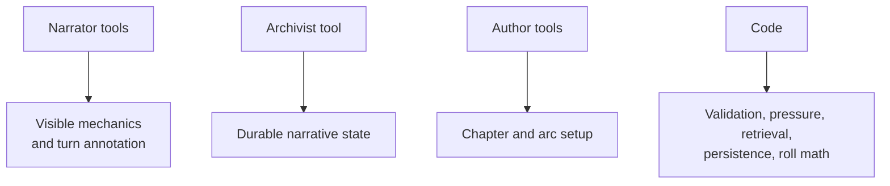

# SF2 Tool Reference

Reference for the active tool surfaces used by the current `/play` SF2 engine.

The tools are role firewalls as much as schemas. If a role needs to write something outside its contract, that is usually a design smell. The code should either move the responsibility to the owning role or make it deterministic.

Sources: `lib/sf2/narrator/tools.ts`, `lib/sf2/archivist/tools.ts`, `lib/sf2/author/tools.ts`, `lib/sf2/arc-author/tools.ts`, `lib/sf2/chapter-meaning/tools.ts`, `lib/sf2/firewall/actor.ts`.

---

## Active Tools

| Tool | Actor | Route | Purpose |
|---|---|---|---|
| `request_roll` | Narrator | `/api/sf2/narrator` | Pause prose for a d20 check |
| `narrate_turn` | Narrator | `/api/sf2/narrator` | Commit final annotation, visible mechanical effects, suggested actions |
| `extract_turn` | Archivist | `/api/sf2/archivist` | Extract durable narrative-state writes from prose |
| `author_arc_setup` | Arc Author | `/api/sf2/arc-author` | Create the multi-chapter arc plan and initial arc threads |
| `author_chapter_setup` | Author | `/api/sf2/author` | Create the current chapter frame and pressure surface |
| `synthesize_chapter_meaning` | Chapter Meaning | `/api/sf2/chapter-meaning` | Interpret a closed chapter for the next chapter Author |

## Ownership Map

The actor firewall enforces the map:

| Actor | May write |
|---|---|
| Narrator | `hp_delta`, `credits_delta`, `inventory_use`, `set_location`, `scene_end`, `set_scene_snapshot`, `pending_check`, `suggested_actions`, `narrator_annotation` |
| Archivist | `create_entity`, `update_entity`, `entity_transition`, `anchor_attachment`, `pacing_classification`, `drift_flag` |
| Author | `chapter_setup`, `chapter_meaning` |
| Code | `face_shift`, `ladder_fire`, `passive_awareness_delivered`, `working_set_compute`, `cohesion_recompute`, `drift_flag` |

## Narrator: `request_roll`

Purpose: pause the prose at the moment of uncertainty and ask the browser to resolve a d20 check.

Required fields:

| Field | Meaning |
|---|---|
| `skill` | Skill or ability name |
| `dc` | Difficulty class, usually 5-25 |
| `why` | One-sentence reason the roll is required |
| `consequence_on_fail` | Concrete fail-forward consequence |

Optional fields:

| Field | Meaning |
|---|---|
| `modifier_type` | `advantage`, `disadvantage`, or `challenge` |
| `modifier_reason` | Short reason for the modifier |

Rules:

- call before the outcome is narrated
- stop narration after the tool call
- resume only after the browser sends `rollResolution`
- do not put DC math or raw roll values into player-facing prose unless the UI is rendering a roll card

## Narrator: `narrate_turn`

Purpose: end the Narrator turn with compact annotations and player-visible mechanical effects.

Main fields:

| Field | Meaning |
|---|---|
| `mechanical_effects` | HP, credits, inventory use, location, scene end, scene snapshot |
| `hinted_entities` | Hints for the Archivist, not durable state writes |
| `authorial_moves` | Pivot/revelation/witness-mark hints |
| `suggested_actions` | 3-4 grounded, useful quick actions for the next turn |

Quick actions are suggestions, not branches. They should use concrete verb + target + intent, avoid resolving the outcome, and open different useful next turns: objective pressure, information/route discovery, pressure/position/resource response, and relationship/promise/moral tension. Skill tags such as `[Insight]` are used only when choosing the option likely commits the player to a risky check.

Allowed mechanical effect kinds:

- `hp_delta`
- `credits_delta`
- `inventory_use`
- `set_location`
- `scene_end`
- `set_scene_snapshot`

The Narrator cannot create NPCs, resolve threads, anchor clues, or update faction state. Those are Archivist writes.

## Archivist: `extract_turn`

Purpose: convert completed prose into durable campaign graph updates.

Top-level fields:

| Field | Meaning |
|---|---|
| `creates` | New NPCs, factions, threads, decisions, promises, obligations, clues, arcs, locations, temporal anchors, documents, procedures |
| `updates` | Changes to existing entities |
| `transitions` | Status transitions for threads, promises, clues, arcs, documents, procedures |
| `attachments` | Anchor decisions, promises, clues, or threads |
| `scene_result` | Scene summary when a scene ended |
| `pacing_classification` | World-initiated signal, scene-end hook kind, tension deltas |
| `pressure_events` | Human-consequence pressure records |
| `coherence_findings` | Drift, uncertainty, or contradiction notes |

Each create/update requires confidence and source evidence. Low-confidence writes are not treated like authoritative durable facts.

Important constraints:

- decisions and promises need anchors
- clues can float only when they are real evidence not yet connected by the PC
- documents preserve original terms; later changes are amendments or supersessions
- procedure facts are not investigation clues unless they answer an investigation question
- thread resolution can be blocked by unsatisfied resolution gates

## Arc Author: `author_arc_setup`

Purpose: create the first durable arc shape from setup selection.

Output becomes:

- `campaign.arcPlan`
- initial arc entity
- arc-level thread set
- durable faction pressure
- campaign-scale questions and stakes

Arc Author runs before Chapter 1 when the state lacks an active arc plan.

## Chapter Author: `author_chapter_setup`

Purpose: create playable chapter pressure.

Output includes:

- chapter frame
- opening scene spec
- antagonist field
- exactly 3 starting NPCs in the current schema section
- 3-4 active chapter threads depending on chapter context
- pressure ladder
- revelation plan
- moral fault lines
- pacing contract
- carry-forward thread transitions when needed

The active route uses one Sonnet tool call. `author_chapter_spine` and `author_pressure_surface` are still present as schema constants, but not active tools.

## Chapter Meaning: `synthesize_chapter_meaning`

Purpose: summarize what a closed chapter means before the next Author call.

This is not a player-facing debrief generator. It creates transition material for future chapter setup:

- what changed
- what the player demonstrated
- what unresolved pressure remains
- what should not be restaged
- which threads or relationships became newly important

## Tool Design Rules

- Keep schemas narrow enough that the model can fill them reliably.
- Prefer sequential role calls over one giant schema when reliability degrades.
- Use code for arithmetic, dedupe, id resolution, validation, and ownership checks.
- Treat annotations as hints unless the owning role and validator accept them.
- When prompt/tool expectations change, inspect the route, tool schema, validator, and replay fixtures together.
